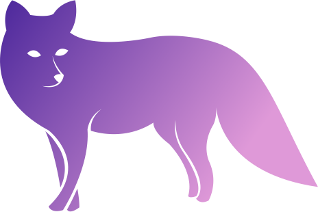

    
  </a>
  <h3 align="center">AngelNull (She/Her)</h3>
  

    Hello! I'm Angel, I tend to create and contribute to Node/JS projects, and enjoy making software to streamline annoying processes or community management programs/bots.
     
 

